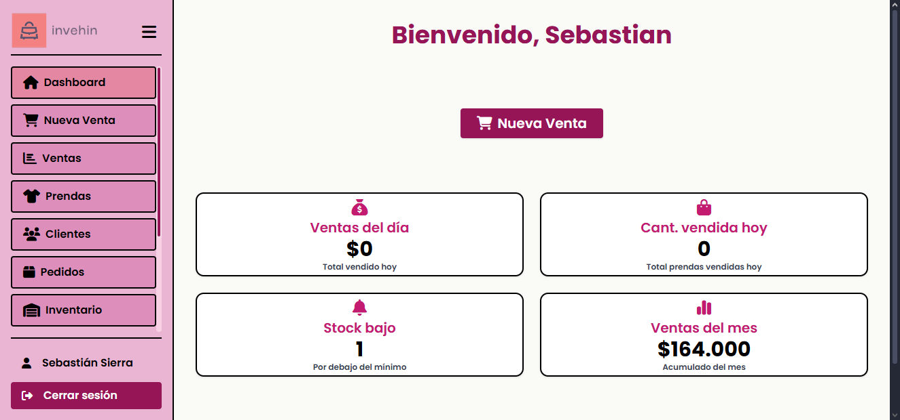
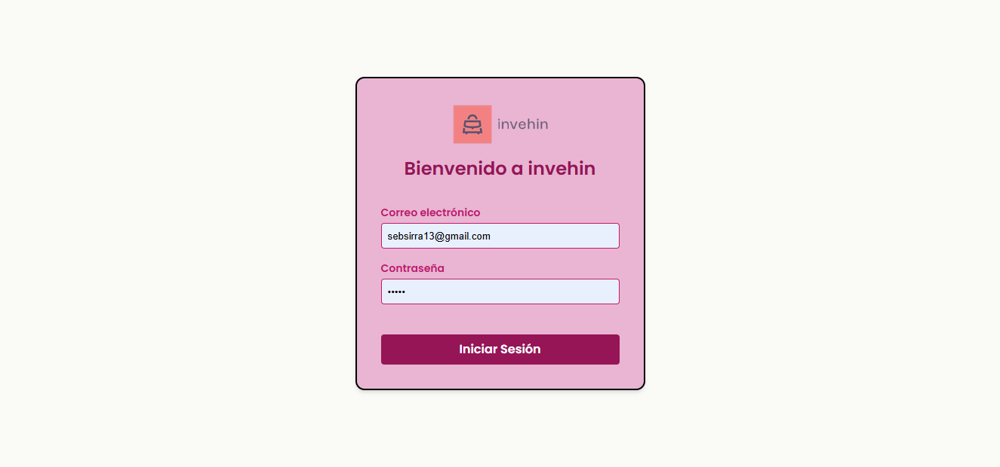
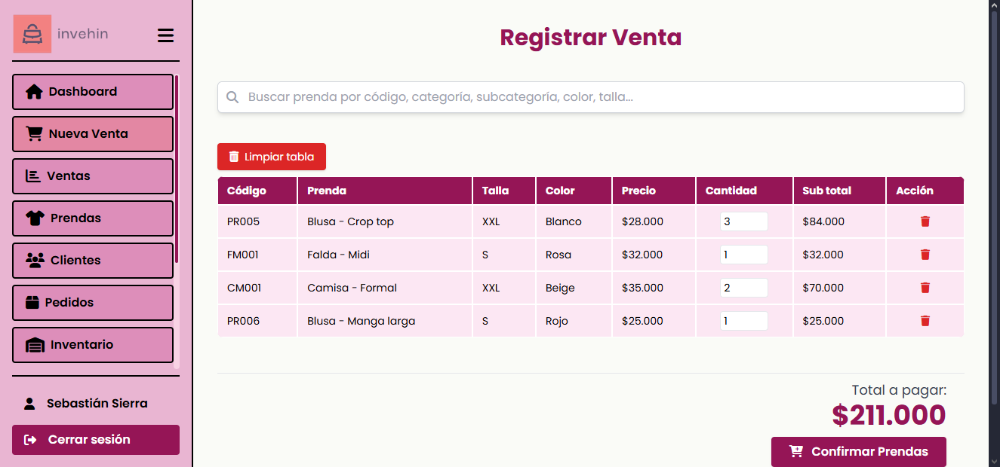
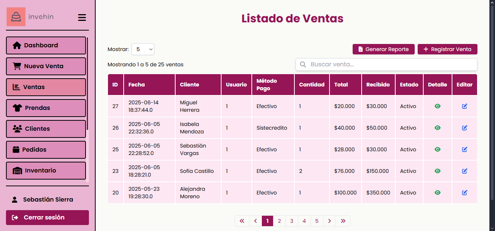
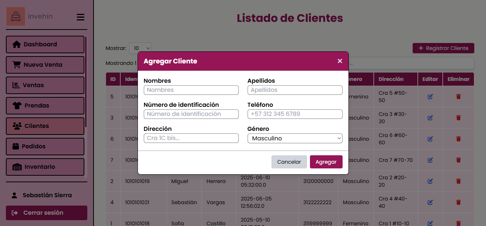
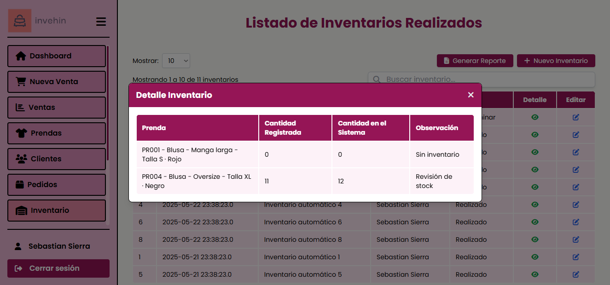
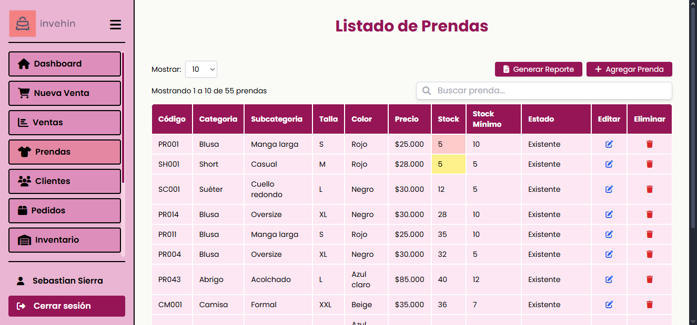
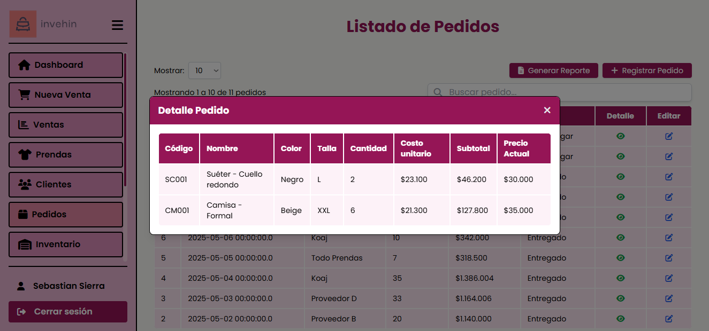
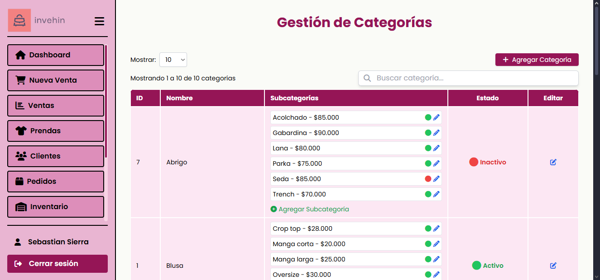

# 📸 Capturas del Sistema – INVEHIN

A continuación se presenta una galería de las principales interfaces del sistema INVEHIN:

---

## 🏠 Dashboard de Inicio

Visualización de estadísticas clave: ventas del día, stock bajo, ventas del mes, entre otras.

---

## 🔐 Pantalla de Inicio de Sesión

---

## 🛒 Registro de Venta

Búsqueda de prendas, selección dinámica, y resumen de pago.

---

## 📊 Módulo de Ventas

Listado completo de ventas con paginación, generación de reportes y filtros.

---

## 👥 Gestión de Clientes

Formulario modal para agregar nuevos clientes.

---

## 📦 Inventario

Vista del inventario de productos, con información de existencias.

---

## 👕 Listado de Prendas

Visualización de las prendas disponibles con detalles.

---

## 🛍️ Pedidos

Módulo para gestionar los pedidos realizados por los clientes.

---

## 🏷️ Categorías

Visualización y gestión de las categorías de productos.

---
